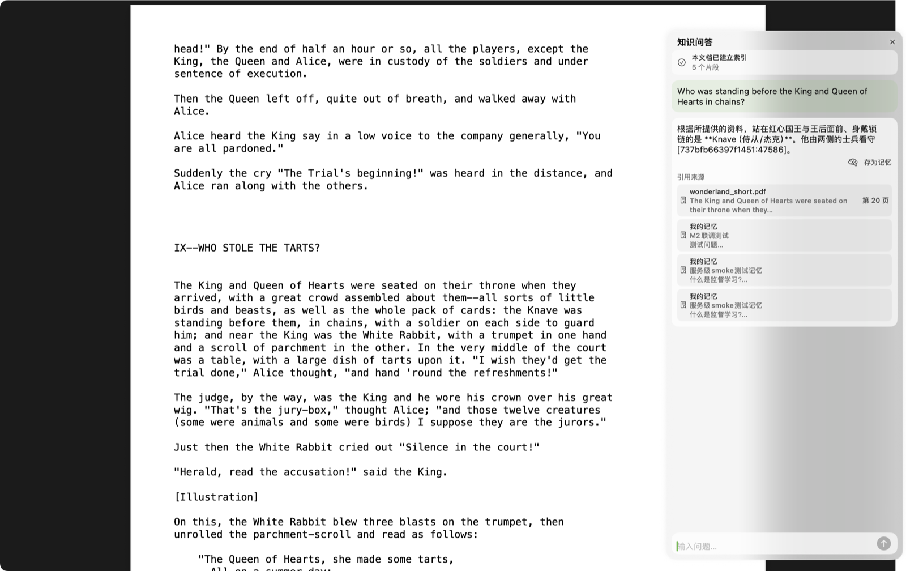
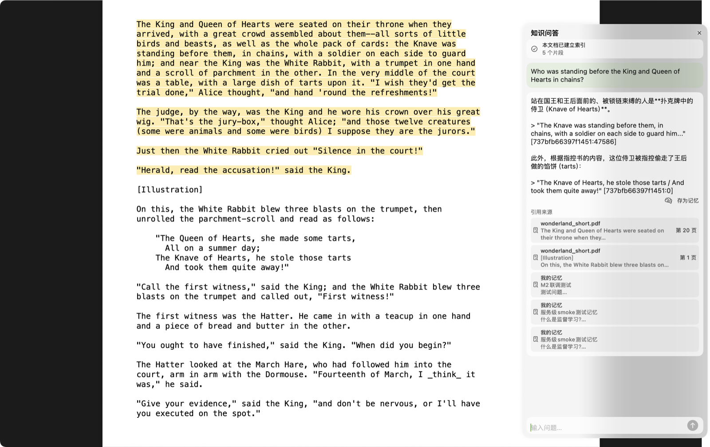
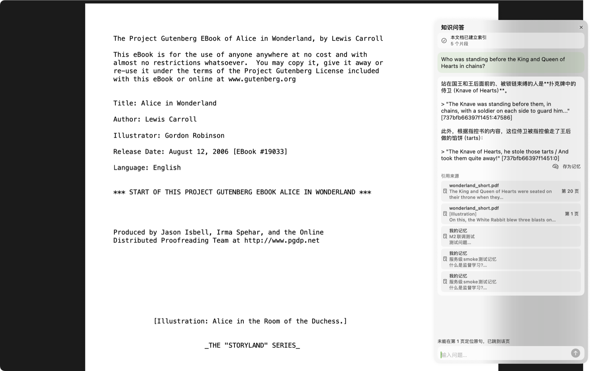
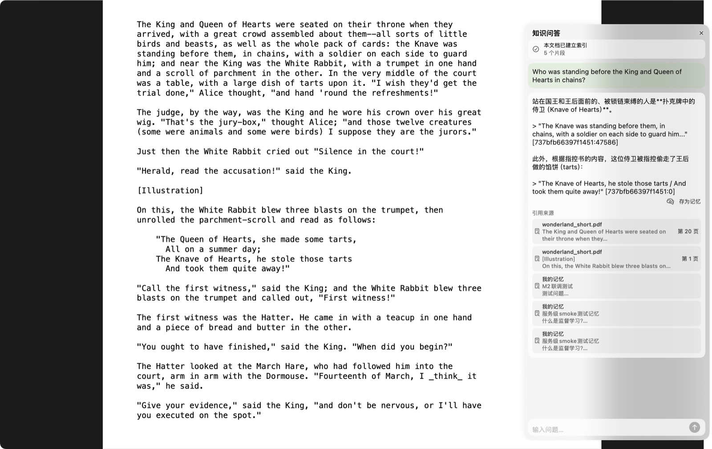

<!-- 走到哪了：由 ideas.py --refresh 生成，不要手改 -->
> [!NOTE]
> **走到哪了 · ● 暂停中**
> 三块都已完成，准备上线
> 下一步：恢复时按上线标准打包，并用全新 macOS 账户走一遍
> 上次更新：2026-09-26
<!-- /走到哪了 -->

## 等你决定
无

## 进度
- [x] 第一块 点引用高亮原句（Mac App）· [[#第一块 点引用高亮原句]] · vibereader-macos `3cdf470`
- [x] 第二块 UniRAG 页码按内容定位 + 知识库重新入库 · 589 个块中 580 个在标注页被 PDFKit 独立找到 · vibereader `310a651`
- [x] 第三块 本页找不到时再找下一页（Mac App）· 587/589 可高亮 · vibereader-macos `d9cefa4`
- [ ] 上线：打包带问答服务的正式版 → 发布前检查 → 新建 macOS 测试账户（需要你本人操作）→ 走通 导入→提问→点引用

## 决定
| 日期 | 定了什么 | 为什么 |
|---|---|---|
| 2026-09-26 | 对不上时模糊匹配，太不像退回只跳页 | 多数时候能亮，亮错比不亮更糟 |
| 2026-09-26 | 高亮保留到下一次点击 | 一直看得见，点别处自然消失 |
| 2026-09-26 | 已入库的 13 份文档先备份再全部重新入库 | 同时补回之前丢失的块（48 → 589） |
| 2026-09-26 | 块的页码按内容定位，不再按字符偏移推算 | 偏移在切块和换解析器后都会漂 |
| 2026-09-26 | 上线标准：本机正式版 + 全新账户走通 | 不花钱、今天能完成；公开分发要付费开发者账号，暂不做 |
| 2026-09-26 | 暂停 | 先专注 yishuship |

## 为什么做
读者在知识问答里拿到带引用的回答后，想回原文核对。原来点引用只跳到页顶，
还得自己在整页里找；中文书的引用没有页码，点了没反应。

## 用户能看到的行为
- [x] 点引用卡片 → 滚到被引用的段落，整段黄色高亮
- [x] 原文对不上（换行、连字符、解析差异）→ 模糊匹配；太不像就只跳页并提示"未能定位原句"
- [x] 高亮一直保留，直到在 PDF 上点下一次
- [x] 引用标的页码 = 原文实际所在页；中文书也有页码

## 证据
### 第一块 点引用高亮原句
改之前：只跳到页顶，被引用的段落没有任何标记

改之后：滚到被引用的段落，整段高亮

对不上时：跳到那一页，并提示"未能定位原句"

高亮保留到下一次点击：5 秒后仍在，点一下 PDF 后消失

## 遗留
- MinerU 密钥返回 401，所有 PDF 都退回了本机解析（services/uni-rag 入库日志）
- App 每秒反复创建销毁 TabManager 等约 50 次，改动之前就存在（Debug 构建的 deinit 日志）
- App 原有 XCTest 整套未跑：本机拒绝电源断言，xcodebuild test 起不来
- UniRAG bdd 有 4 个失败，改动之前就失败（导出 markdown 1 个、前端字符串 3 个）
- 知识库备份：~/vibereader-git-backups/unirag-data-before-page-fix-20260926
