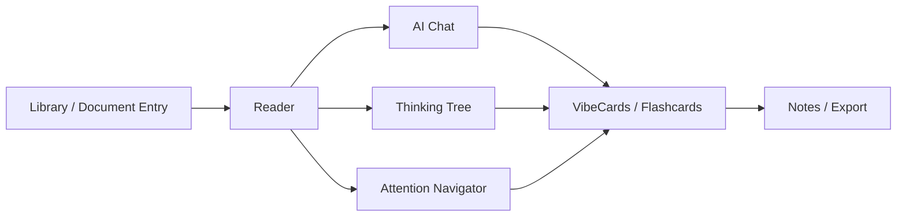

# VibeReader PRD: Rust-backed Local-first AI Reading Workspace

Version: v0.2
Date: 2026-06-11
Project: VibeReader
Product position: local-first AI reading workspace
Current baseline: Tauri v2 + React + Zustand + Ant Design + PDF.js + multi-model AI chat
Direction: preserve the existing React/Tauri product surface, then move durable parsing, storage, indexing, secure key handling, export, and reading-agent orchestration into Rust-backed services.

## 1. Current State

VibeReader is not a greenfield project and should not be routed back into the historical Zotero fork.

The active implementation surface is the standalone app in this repository. The historical `Vibero` / Zotero fork is reference material only unless a task explicitly targets import, bridge, or comparison work.

Verified project identity:

- Product name: `VibeReader`
- Development title: `VibeReader Standalone Dev`
- Tauri bundle id: `cn.yishuziyu.vibereader`
- Rust package: `vibereader`
- NPM package: `vibereader-desktop`
- Dev server: `http://127.0.0.1:3217`

The frontend already has a meaningful reading workspace:

- React 18 + Vite
- Zustand state stores
- Ant Design / Ant Design X
- PDF.js rendering and text layer
- Slate input
- Markdown / math rendering
- model presets for OpenAI-compatible and Anthropic-compatible providers
- panels for Chat, Summary, Flashcards, Thinking Tree, Attention Navigator, and Notes / Artifacts

The Rust side is intentionally light today:

- Tauri app shell
- `tauri-plugin-fs`
- `tauri-plugin-dialog`
- `tauri-plugin-http`
- `tauri-plugin-log`

It does not yet own the durable product data model, SQLite, secure key storage, document indexing, export, or reading-agent task runtime.

## 2. Product Positioning

VibeReader is a local-first AI reading workbench for papers, technical documents, local notes, and long-form web material.

It is not just ChatPDF, and it is not a Zotero replacement. The core job is:

```text
turn long documents into navigable, source-grounded, annotatable, reviewable, exportable reading objects
```

The product should optimize for:

- local-first document handling
- source-grounded AI help
- document structure understanding
- paragraph-level navigation
- attention routing
- reusable reading cards
- multi-model support
- visible reading process
- bounded reading-agent tasks

## 3. Users

Core users:

- graduate students and PhD students
- researchers
- technical learners
- open-source project readers
- independent developers reading long API / design / code documents

High-value early users:

```text
────────────────────────────────────────────────────────────
User              Materials                 Core need
────────────────────────────────────────────────────────────
AI / CS student   papers, READMEs, docs      method, experiment, code links
Economics student papers, slides, working papers research question, strategy, data, result
Indie developer   API docs, repos, specs     convert material into notes and tasks
────────────────────────────────────────────────────────────
```

Their problem is not "can I chat with a PDF". Their problem is that long documents are hard to structure, AI answers often detach from the source, and reading outputs do not persist into a durable knowledge workflow.

## 4. Product Goals

The next product goal is to stabilize the current reading loop into a continuously usable product.

Must work:

- open PDF, Markdown, TXT, and safe HTML
- render, page, zoom, fit width, and select text in PDFs
- bind document context to AI chat without cross-document contamination
- stream AI output, stop generation, and show clear provider errors
- generate and persist summaries, cards, annotations, thinking tree output, and attention insights
- preserve document-scoped state across reloads and app restarts
- support automated checks for the main reading flows

Mid-term goals:

- Rust-backed SQLite data layer
- unified Document Model
- unified Annotation / VibeCard / Insight model
- source refs for AI answers
- retrieval-style chat instead of default whole-document context injection
- Notes / Markdown / JSON export
- secure model-key storage
- local search and later semantic retrieval
- bounded reading-agent task orchestration

Long-term goals:

- VibeReader becomes the desktop entrance for personal reading knowledge work
- documents are parsed into structured reading objects
- AI helps users locate, understand, card, annotate, and export important material
- reading outputs can flow to Obsidian, Zotero notes, course notes, implementation docs, or local knowledge bases

## 5. Non-goals

Do not do these in the current product cycle:

- rewrite Zotero
- build a complete reference manager
- build multi-user collaboration
- build mobile apps
- replace PDF.js visual rendering
- train a model
- treat AI output as academic fact
- keep growing non-durable frontend-only state
- market "Agent" as a label before there are tools, task state, and persisted outputs

## 6. Core Product Modules



Main workspace:

```text
────────────────────────────────────────────────────────────────
Area       Current role                         Target role
────────────────────────────────────────────────────────────────
Left       session/open-file entry              documents, recent, sessions, settings
Center     PDF / document reader                primary reading surface
Right      chat/summary/cards/tree/attention    AI reading tools and Notes
────────────────────────────────────────────────────────────────
```

## 7. Functional Requirements

### 7.1 Document Opening

Current support:

- `pdf`
- `md`
- `markdown`
- `txt`
- `html`
- `htm`

Requirements:

- preserve browser upload and drag/drop
- preserve Tauri native file open
- assign every opened document a stable `document_id`
- record file type, size, opened time, parse status, and source path where available
- detect repeat opens as existing document or new version instead of uncontrolled duplicates
- persist recent documents

Priority:

- P0: durable document records
- P1: recent documents and parse status
- P2: tags, favorites, archive

### 7.2 Reader / PDF

Requirements:

- the reader remains the center of the product
- AI panels must not overpower the reading surface
- selection actions include Ask AI, Explain, Highlight, Save Note, Create VibeCard, Generate Flashcard
- Thinking Tree and Attention clicks jump to page and paragraph
- highlights and notes persist
- PDF outline is supported
- scanned PDFs receive a clear explanation and an explicit OCR path

Acceptance:

- a normal under-50-page paper shows page 1 quickly
- page, zoom, and fit width do not visibly break layout
- selecting text shows the operation toolbar
- persisted highlights return after reopening the document
- paragraph jump lands on the correct page and briefly highlights the target
- PDFs without a text layer explain the limitation

### 7.3 AI Chat

Requirements:

- chat is bound to the active document
- switching documents isolates chat history and document context
- selected PDF text can be dragged into the input
- cards, summaries, and insights can be sent or dragged into chat
- answers should carry source refs when supported by the document
- stop generation preserves partial output
- failure messages remain visible
- thinking is collapsed by default and expandable
- model capability controls multimodal affordances

Known risk:

- whole-document context injection is not a sustainable default for long documents.

Priority:

- P0: keep whole-context mode but warn on length
- P1: retrieval-style context using relevant chunks
- P1: source refs per answer
- P2: local vector index
- P2: explicit answer modes: selection, page, section, full-document relevant chunks

### 7.4 Model Configuration

Requirements:

- separate provider presets from custom models
- presets fill base URL, protocol, auth mode, default model, and region hints
- custom models require explicit OpenAI-compatible or Anthropic-compatible protocol
- vision support can be manually overridden
- API keys must never appear in logs, exported files, or user-facing error payloads
- desktop should move API keys to secure storage

Acceptance:

- a new user can configure a model quickly
- test connection returns clear success or failure
- switching model does not delete chat history
- image input to a non-vision model gives an actionable message
- API key is absent from logs, errors, and exports

### 7.5 Summary

Summary should become a reading entrypoint, not only a section list.

Levels:

```text
────────────────────────────────────────────────────────────
Level              Job                  Output
────────────────────────────────────────────────────────────
Paper Summary      whole paper          question, method, conclusion, contribution, limits
Section Summary    section              role, key points, relation to paper
Paragraph Summary  local explanation    meaning, terms, logic, common misread
────────────────────────────────────────────────────────────
```

Priority:

- P0: keep current section summaries, add whole-paper summary, persist results, regenerate, send to Chat, save to Notes
- P1: use PDF outline and title signals, structured JSON schema, quality checks, Chinese/English output switch

### 7.6 VibeCard / Flashcard

Flashcards remain useful, but the product primitive should be VibeCard.

VibeCard types:

- Quote Card
- Explain Card
- Concept Card
- Method Card
- Evidence Card
- Figure Card
- Formula Card
- Question Card
- Flashcard
- Note Card

Shape:

```json
{
  "id": "card_xxx",
  "document_id": "doc_xxx",
  "type": "quote | explain | concept | method | evidence | figure | formula | question | flashcard | note",
  "title": "string",
  "source_text": "string",
  "ai_content": "string",
  "user_note": "string",
  "page": 1,
  "paragraph_id": "page-1-para-3",
  "tags": ["method", "important"],
  "created_at": "datetime",
  "updated_at": "datetime"
}
```

Priority:

- P0: document-isolated flashcards, better generation source modes, local persistence, source jump
- P1: unify Flashcard under VibeCard, create cards from selection, AI answer, summary, and insight, drag cards into Chat
- P2: spaced repetition, Anki CSV export, Obsidian Markdown export, related cards

Acceptance:

- every card has a source or is marked as ungrounded
- deleting a deck requires confirmation
- review progress persists
- selection-created cards record page and paragraph id

### 7.7 Thinking Tree

Thinking Tree should answer:

```text
How does this document unfold its thinking?
```

Priority:

- P0: preserve current tree generation, click-to-jump, page labels, persistence
- P1: AI rewritten node summaries, Ask AI on nodes, section explanations, node-to-VibeCard, important-node filtering
- P2: Argument Tree, Method Tree, Study Tree, user-editable nodes

Acceptance:

- tree generation does not block the UI
- 100-page PDFs can produce a base tree in acceptable time
- node click jumps to the correct page
- PDF paragraph selection expands the corresponding node
- tree state restores after restart

### 7.8 Attention Navigator

Attention Navigator is a core differentiator. It should answer:

```text
Where should I look first?
```

Insight types:

```text
Problem | Claim | Method | Evidence | Result | Limitation | Definition | Formula | Figure | Warning
```

Priority:

- P0: analyze key locations, click-to-jump, show PDF attention markers, display type/description/page, re-analyze
- P1: persist insights, read/unread state, convert to VibeCard, send to Chat, structured model output, type filters
- P2: goal-aware ranking, 10-minute route, 30-minute deep-reading route

Acceptance:

- every insight has a clickable location
- failed jumps explain why
- analysis can be cancelled
- results persist
- users can distinguish rule-based from AI-generated insight

### 7.9 Notes / Export

Users need an output surface after reading.

Default Markdown structure:

```md
# Reading Note

## Metadata
- Title:
- Source:
- Opened At:

## One-line Summary

## Key Questions

## Structure

## Important Insights

## VibeCards

## Flashcards

## AI Q&A

## My Notes

## Follow-up
```

Priority:

- P0: export current document summaries, cards, Q&A, highlights, and notes to Markdown and JSON with preview
- P1: Obsidian format, templates, selected cards only, save AI answer to Notes, Zotero Note via API or bridge only

Acceptance:

- exports include source page references
- Markdown opens cleanly in Obsidian
- JSON can be re-imported
- export failures are clear
- API keys, request headers, and internal logs never enter exports

## 8. Local Data Layer

Keep Zustand for UI state. Move long-term product data into a local database.

Recommended SQLite tables:

- `documents`
- `document_contents`
- `document_chunks`
- `conversations`
- `messages`
- `annotations`
- `vibecards`
- `flashcard_decks`
- `flashcards`
- `summaries`
- `thinking_trees`
- `attention_insights`
- `model_configs`
- `app_settings`

Data boundary:

```text
────────────────────────────────────────────────────────────
Data                  Current / near-term        Target
────────────────────────────────────────────────────────────
UI collapsed state    Zustand                    Zustand
page / zoom           Zustand + settings         SQLite-backed setting
document list         documentStore              SQLite
parsed PDF text       pdfStore                   SQLite / file cache
chat history          browser storage            SQLite
vibe data             vibeStore                  SQLite
cards                 flashcard/artifact stores   SQLite
annotations           annotation service          SQLite
API keys              frontend config             secure storage
────────────────────────────────────────────────────────────
```

Acceptance:

- recent documents remain after restart
- highlights, notes, cards, summaries, and insights remain after restart
- deleting a document handles related data deliberately
- database has schema versioning
- migration failure does not destroy existing data

## 9. Rust Backend Direction

Rust should not rewrite the UI. Rust should own reliability, data, security, indexing, export, and task orchestration.

Suggested structure:

```text
src-tauri/
  src/
    lib.rs
    commands/
      document.rs
      ai.rs
      storage.rs
      export.rs
      search.rs
      agent.rs
    core/
      document_model.rs
      error.rs
      task.rs
    services/
      pdf_text.rs
      sqlite.rs
      keyring.rs
      chunker.rs
      embedding.rs
      export_markdown.rs
```

P0 Rust tasks:

- SQLite initialization
- Documents CRUD
- Annotations CRUD
- VibeCards CRUD
- Conversations CRUD
- Markdown export
- API key secure storage or at minimum redaction from logs/errors
- unified error shape

P1 Rust tasks:

- PDF text parse command or unified parser orchestration
- chunk generation
- full-text search
- background task queue
- task progress events
- Rust AI proxy to solve CORS and frontend key exposure

P2 Rust tasks:

- local embeddings
- local vector index
- reading-agent tool runtime
- Zotero bridge
- batch document import

Acceptance:

- Rust commands use a unified error format
- frontend does not directly handle sensitive keys
- long tasks can be cancelled
- progress events reach the UI
- database operations have tests

## 10. Reading Agent Requirements

VibeReader's Agent is not a chat persona. It is a bounded reading-task runtime.

Useful tasks:

- analyze document structure
- locate key paragraphs
- generate a reading route
- create VibeCards
- create flashcards
- answer questions with citations
- export notes
- check whether an answer has evidence

Initial tool registry:

```text
────────────────────────────────────────────────────────────────
Tool                       Input                         Output
────────────────────────────────────────────────────────────────
get_current_document       document_id                   metadata
get_document_chunks        document_id, query            chunks
get_page_text              page                          text
create_vibecard            card payload                  card_id
create_annotation          annotation payload            annotation_id
list_attention_insights    document_id                   insights
export_note                document_id, template         file path
search_document            query                         matched chunks
────────────────────────────────────────────────────────────────
```

Task types:

- P1: `paper_overview_agent`
- P1: `section_summary_agent`
- P1: `attention_agent`
- P1: `flashcard_agent`
- P1: `note_export_agent`
- P2: `literature_review_agent`
- P2: `code_reading_agent`
- P2: `method_explainer_agent`
- P2: `exam_prep_agent`

Acceptance:

- every task has state: `pending`, `running`, `succeeded`, `failed`, `cancelled`
- failed tasks can be retried
- outputs are persisted
- users see useful progress, not raw internal noise
- factual claims must be source-backed or marked as inference / ungrounded

## 11. Information Architecture

Left sidebar target:

- Documents
- Recent
- Sessions
- Collections
- Settings

Center reader target:

- PDF
- Text
- Outline
- Notes Preview

Right AI tool area:

- Chat
- Summary
- Cards
- Thinking Tree
- Attention
- Notes

The center reading surface should remain visually dominant.

## 12. Privacy and Security

Default rules:

- local files are not uploaded by default
- cloud model calls happen only after an explicit user action
- first cloud model request should explain what will be sent
- API keys never enter logs, errors, exports, or project docs
- users can clear one document's AI history
- users can clear all local data

Security path:

- P0: redact keys from errors/logs and avoid writing them into docs/exports
- P1: Rust keychain / secure storage
- P2: Rust-owned model requests so the frontend does not directly hold keys

## 13. Performance Requirements

Startup:

- show the main UI within 3 seconds
- lazy panels must not block startup
- recent documents must not block startup

Document open:

- under-50-page PDF shows page 1 quickly
- 200-page PDF can show page 1 first, then parse in the background
- parsing shows progress
- parse failure does not crash the app

AI:

- sending enters generation state immediately
- streaming output updates in real time
- stop generation works
- failed model calls preserve user input and visible error state

Local data:

- recent 100 documents load within 300ms
- 1000 cards in one document remain usable
- P1 full-text search targets sub-500ms response

## 14. Testing and QA

P0 automated coverage:

- app starts
- homepage renders
- sample Markdown opens
- sample PDF opens
- Chat / Summary / Cards / Tree / Attention tabs switch
- highlight can be created
- note can be created
- card can be created
- session can be cleared
- model configuration validates

P1 automated coverage:

- SQLite initializes
- document persists
- highlight persists
- card persists
- summary persists
- Markdown export works
- document switching isolates state
- long parse can be cancelled

Manual QA documents:

- English text-layer paper
- Chinese text-layer PDF
- scanned PDF
- 100+ page PDF
- Markdown
- HTML

## 15. Version Plan

### Phase 0: stabilize current reading loop

Goal: make the current development build continuously usable.

Scope:

- document opening
- PDF reader stability
- chat error handling
- multi-document isolation
- cross-panel state boundaries
- current store/data boundary audit

Deliverables:

- `docs/current-state.md`
- `docs/data-model-draft.md`
- `docs/qa-checklist.md`

Acceptance:

- `npm run test` passes
- `npm run qa:smoke` passes
- `npm run tauri:dev` starts
- one real PDF can be opened and used for a Chat interaction

### Phase 1: local data layer

Goal: fix restart data loss and scattered long-term state.

Scope:

- Rust SQLite initialization
- document, conversation, message, annotation, card, summary, attention insight, thinking tree records
- Tauri command contract

Acceptance:

- documents remain after restart
- chat remains after restart
- highlights remain after restart
- cards remain after restart
- document deletion handles related data deliberately

### Phase 2: VibeCard unification

Goal: upgrade Flashcard into a source-grounded card system.

Scope:

- VibeCard data model
- create from selection, AI answer, summary, and insight
- drag into Chat
- jump back to source
- Markdown export

Acceptance:

- every card has source metadata or an ungrounded marker
- cards can be edited and deleted
- cards can be dragged into Chat
- flashcard study remains available as one card mode

### Phase 3: retrieval-style AI chat

Goal: move from whole-document context to relevant-source answering.

Scope:

- document chunks
- local search
- answer source refs
- clickable citations
- long-document context trimming
- answer modes: selection, page, section, full-document relevant chunks

Acceptance:

- 200-page PDFs can be queried
- answers cite sources
- citations jump to the document
- whole document is not injected by default
- unsupported claims are marked as no evidence / inference

### Phase 4: Attention Navigator 2.0

Goal: make attention routing a signature feature.

Scope:

- insight schema
- ranking
- 10-minute route
- 30-minute deep-reading route
- persistence
- read/unread
- insight-to-card
- better PDF markers

Acceptance:

- user can find key paragraphs quickly
- every insight has a location
- insight type quality can be manually reviewed
- read state persists
- re-analysis works

### Phase 5: reading-agent tasks

Goal: turn VibeReader from chat tool into task-based reading workspace.

Scope:

- tool registry
- agent task state
- Paper Overview Agent
- Attention Agent
- Card Generation Agent
- Note Export Agent
- task progress UI
- cancel and retry

Acceptance:

- one-click reading package works
- package includes summary, key locations, cards, and note draft
- failed task can retry
- outputs persist
- tool traces are useful and redact sensitive data

## 16. Success Metrics

Product usability:

- new user opens first document within 3 minutes
- first AI question within 5 minutes
- summary, key location, and 3 cards within 10 minutes
- no crash in a normal reading session
- reading state restores after restart

Reading effectiveness:

- user can judge whether a document deserves deep reading
- user can locate core paragraphs through Attention
- user can understand structure through Thinking Tree
- user can save important content as cards
- user can export useful notes

Technical quality:

- main flows have automated tests
- Rust commands share an error format
- local database has migrations
- AI failures do not corrupt conversations
- parse failures do not affect unrelated documents

## 17. Core Product Judgment

The direction is not "rewrite Vibero in Rust".

The direction is:

```text
VibeReader = React reading workspace + Rust-backed local reliability layer
```

That means:

- keep the existing React frontend because the reader, chat, and panels already exist
- use Rust for persistence, secure keys, indexing, parsing orchestration, exports, and task runtime
- keep the Zotero fork as reference / future bridge material only
- prioritize Thinking Tree, Attention Navigator, VibeCard, source-grounded Chat, and reading-agent tasks
- do not add more model providers before the data layer, source refs, cards, and export loop are reliable
