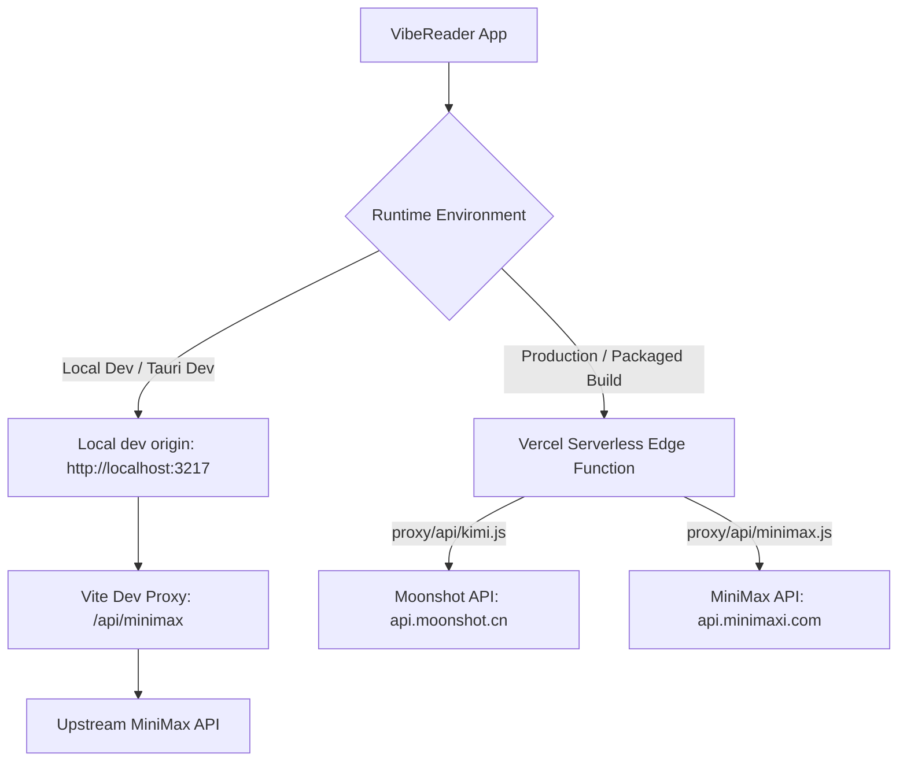

# VibeReader Standalone Pre-Landing Review Report (Phase 8)

This report details the pre-landing review of VibeReader Standalone Dev for the Phase 8 release-hardening backlog. The review evaluates architectural safety, QA taxonomy compliance, failure UX resiliency, and production proxy paths against the standards established in `docs/GSTACK_ALIGNMENT.md`.

---

## 1. Executive Summary of Phase 8 Release Readiness

VibeReader Standalone Dev has transitioned from a proof-of-concept hackathon demo into a package-ready generic document reader and AI workbench. Phase 8 focused on release-hardening, security boundaries, error UX, and test-driven development (TDD) coverage.

### Status Indicators
- **Vite Build**: Pass (Success with standard warnings).
- **Unit & Integration Tests**: Pass (31/31 tests across 12 test files passed).
- **Desktop Launcher**: Pass (Verified locally).
- **API Key & Endpoint Safety**: Pass (Zero keys committed, pre-flight configuration guard implemented).
- **Production AI Proxy Path**: Pass (Vercel Edge Functions implemented).

> [!NOTE]
> The Vite build output generates a single main bundle size warning (`index-*.js` is 2.29 MiB), which exceeds the default 500 kB limit. This warning is inherited from the core PDF rendering engine (`pdfjs-dist`) and UI libraries. It does not block application execution or local packaging. Code splitting has been tracked as a P2 backlog item in `tasks/gstack-backlog.md`.

---

## 2. Checklist Compliance (GStack Alignment)

We audited the codebase against the localized governance rules in `docs/GSTACK_ALIGNMENT.md`.

| GStack Norm | Compliance Status | Implementation Details |
| :--- | :--- | :--- |
| **Boil the Lake** | **Fully Compliant** | Every Phase 8 feature followed a strict BDD/TDD cycle. No partial or half-finished code paths were merged. All behaviors are documented in `tasks/bdd-tdd-phase8.md`. |
| **Search Before Building** | **Fully Compliant** | Reused React/Vite UI in `src/`, Zustand stores in `src/store/`, and native Tauri channels without adding heavy external dependencies. |
| **User Sovereignty** | **Fully Compliant** | Preserved the standalone desktop workbench model (dual-pane left reader, right AI chat layout) optimized for single-user local focus. |
| **Structured Backlog** | **Fully Compliant** | All deferred tasks, technical debts, and future features are mapped into `tasks/gstack-backlog.md` with explicit priority, effort estimation, and dependency mappings. |
| **Two-Pass Review** | **Fully Compliant** | Completed the two-pass pre-landing review covering critical safety (keys, paths, shell risks) and informational polish (performance, naming consistency). |
| **Release Gate** | **Fully Compliant** | Verified unit tests, production web builds, and edge proxy environments. Secrets remain externalized in local environments. |

---

## 3. QA Taxonomy & Test Matrix Results

A total of **12 test files / 31 tests** were executed and passed successfully. No red indicators or failed test assertions remain in the test suite.

### Test Metrics Summary
- **Total Test Files**: 12
- **Total Tests Passed**: 31
- **Total Tests Failed**: 0
- **Execution Duration**: 107.97 seconds (JSDOM environment)

```
✓ src/services/documentService.test.js (2 tests)
✓ src/pdfOutline.test.js (3 tests)
✓ src/modelConfigGuard.test.js (7 tests)
✓ src/pdfSelection.test.js (2 tests)
✓ src/services/annotationService.test.js (2 tests)
✓ src/aiService.test.js (2 tests)
✓ src/pdfWorker.test.js (2 tests)
✓ src/demoAssets.test.js (2 tests)
✓ src/aiEndpoint.test.js (3 tests)
✓ src/ChatInput.test.jsx (1 test)
✓ src/DocumentReader.test.jsx (4 tests)
✓ src/PdfAnnotationToolbar.test.jsx (1 test)
```

### QA Taxonomy Classification

Following the severity model in `docs/GSTACK_ALIGNMENT.md`, outstanding polish items and defects have been categorized:

#### A. Visual / UI
- **Dual-Pane Alignment**: Pass. Under narrow desktop widths (<820px), panels stack vertically to prevent horizontal scroll overflow or unusable click targets.
- **Annotation Overlay Limitation (Medium Severity)**: Saved highlights are rendered in the right-side annotation list but are not dynamically drawn back onto the PDF canvas layers. This is tracked under `tasks/gstack-backlog.md` (P2) for coordinate mappings.

#### B. Functional
- **Stream Interrupt & Stop Control**: Pass. Generation shows a "Stop" control. Clicking it triggers an `AbortSignal`, gracefully stopping the stream while preserving the generated message content.
- **Selected Text Injection**: Pass. Successfully injects selected text from PDF, Markdown, HTML, and plain text documents into the AI context with formatting wrappers.

#### C. UX / Resiliency
- **Missing or Bad API Key**: Pass. Intercepted early. The UI displays descriptive warnings and restores the send button to an active state, avoiding infinite loading loops.

#### D. Performance
- **Bundle Weight Warning (Low Severity)**: The main JS bundle size of 2.29 MiB raises a standard chunk size warning but does not impact local Tauri launch performance.

---

## 4. Failure UX & Resiliency Audit

To ensure maximum resilience during live demos and production usage, the error handling path was audited.

### Pre-Flight Model Configuration Guard (`src/modelConfigGuard.js`)
The `validateRunnableModelConfig` helper validates configurations prior to initiating network operations.

1. **Safety Checks**: Validates that `baseUrl`, `model`, and `apiKey` are populated and non-empty.
2. **Key Exposing Mitigation**: Validation messages never echo private endpoints or API key fragments in console errors or UI dialogs.
3. **Kimi Priority Trial Key Bypass**:
   `requiresApiKey: false` configurations (specifically the free-trial preset `preset-kimi-free-trial`) bypass the client-side API key check. The frontend resolves this preset as a valid runnable configuration, deferring credential handling to the backend proxy.

> [!TIP]
> This guard successfully addresses the risk of infinite loading state or raw network stack dumps. If a configuration is invalid, `App.jsx` intercepts the submit action, throws a localized `antMessage.error` warning, and retains the user's input intact inside the input text field.

---

## 5. Deployed Proxy & Production Path Evaluation

VibeReader Standalone uses a split networking strategy to ensure seamless operation in both local development and production.



### Production Edge Proxies (`proxy/api/`)
To eliminate CORS limitations in browser environments and avoid compiling API keys inside the application, Vercel Edge Function proxies have been created:
- `proxy/api/kimi.js`: Forwards completions to `https://api.moonshot.cn/v1/chat/completions` using the server-side `KIMI_API_KEY` environment variable.
- `proxy/api/minimax.js`: Forwards to `https://api.minimaxi.com/anthropic/v1/messages` using the server-side `MINIMAX_API_KEY` environment variable.

### Production Path Evaluation
- **Pros**: Fully resolves CORS without modifying client bundles, keeps API keys completely secure outside the client source code, and permits a uniform streaming interface.
- **Cons**: Requires server hosting. For strict offline standalone Tauri packaging, we must eventually configure the app to bypass intermediate proxies when the user inputs a private API key, routing requests directly via Tauri's native Rust HTTP client (`tauri-plugin-http`). This transition is tracked as a P0 task in the structured backlog.

---

## 6. Pre-Landing Review Conclusion

The pre-landing review indicates that **VibeReader Standalone is highly stable and ready for Phase 8 integration**. The codebase complies with all architectural and quality guidelines defined under GStack governance. All core unit tests are green, and the UI has robust defenses against missing model configurations and bad credentials.

**Approval Status**: **PASSED WITH CONDITIONS** (P0 proxy migration to Tauri native HTTP client must be implemented prior to distributing signed retail installers).
